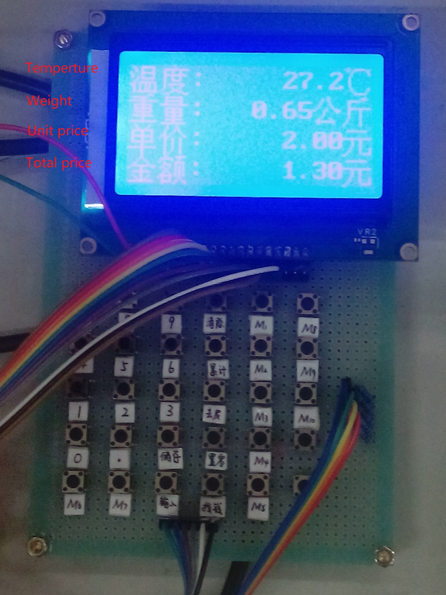
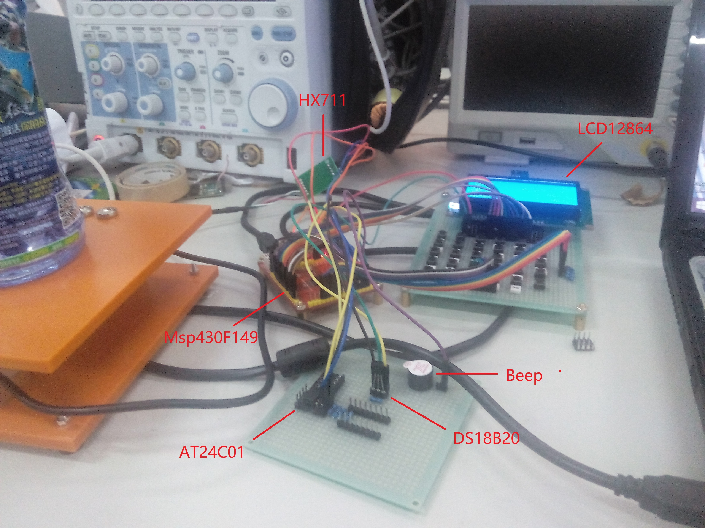

# Multi-function-electronic-scales
This is an eletronic design when my team attended the 5th Electronic Design Contest of Nanjing University of Information Science and Technology, and I am responsible for the selection of hardware and programming. This is a IAR project. 

**Basic requirements**:
* The unit price can be set by keyboard, and the weight, unit price and total amount can be displayed simultaneously after weighing. Electronic weighing scale: the maximum weight is 15.000 kg, and the weight error is not more than ± 0.1%.
* With digital display, display weight, unit price, total amount and other information.
    1. The weight is displayed as a 5-digit number in kilograms, and the maximum weight is displayed as 99.999 kilograms.
    2. The unit price is displayed as a 5-digit number, and the unit is yuan. The maximum value of the unit price is 999.99 yuan.
    3. The total amount is displayed as 6 digits, the unit is yuan, and the maximum total amount is 9999.99 yuan, The total amount error shall not be greater than 0.01 yuan.
* It has the function of peeling and total sum accumulation calculation.
* The unit price of 10 goods can be stored in advance, you can call it up and use it.
* Measure and display the ambient temperature with a temperature measurement error no greater than 1℃.

**The main hardware selections are as follows**:
* MCU ： MSP430F149
* Display : LCD12864
* Weighing sensor : HX711
* Memory chip : AT24C01
* Temperature sensor : DS18B20
* Piezo Buzzer

**Project pictures**:

